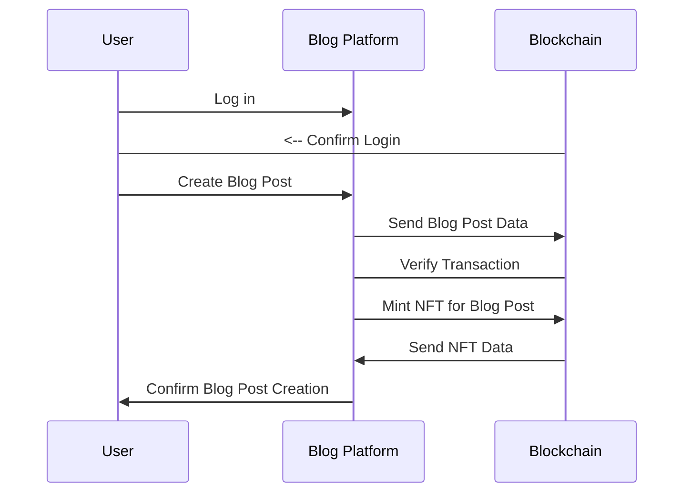

# README.md

# HashHaive

  

## Project Description

The objective of this project is to develop a decentralized blogging platform that leverages blockchain technology to enable the minting of articles as non-fungible tokens (NFTs). The platform will provide a secure and transparent way for bloggers to create and share their content, while also offering unique ownership and monetization opportunities through the creation of NFTs.

The platform will allow users to create an account and log in to the platform using their credentials. Once logged in, users will be able to create blog posts and submit them for verification. The verification process will involve the use of smart contracts on the blockchain to ensure that the content meets certain quality standards and has not been plagiarized. Once the content is verified, it will be minted as an NFT.

The NFTs will contain metadata that will identify the author, date of creation, and other relevant information about the blog post. The NFTs will also enable unique ownership of the content, allowing bloggers to sell, trade, or license their articles as they see fit. The platform will provide a marketplace for users to buy, sell, or trade their NFTs with other users.

To enable monetization, the platform will use a token economy, where users can earn tokens for creating quality content or participating in the community. These tokens can be used to buy NFTs or traded for other cryptocurrencies.

The platform will also provide social features, such as the ability for users to follow other bloggers and comment on their posts. These social features will help create a vibrant community around the platform, encouraging collaboration and engagement among users.

To ensure scalability and speed, the platform will use a sharding mechanism, allowing it to process a large number of transactions at once. The platform will also be designed to be interoperable, enabling users to share their content on other platforms seamlessly.

## Deployed App


Public URL: https://hashhive.netlify.app


Contract is deployed on DCOMM_GOLD_COAST Blockchain

### Smart Contract Layer

The dApp is based on [@openzeppelin/contracts], which is able to take the metadata and convert it into NFTs. As such, the smart contract will be minting ERC-721 tokens using an ERC-721 contract.

  
#### Smart Contracts Addresses

The application utilises the following  smart contracts, which is deployed to the **DCOMM_GOLD_COAST** testnet, at the following addresse:

- HashHive (ERC721): (0x12c7159ee5Cb747859b96620cA5DEa971aa47c66)

  
---
The following is a sequence diagram outlining the contract interactions:


---
    
### Frontend Layer
The frontend layer is a [next](https://nestjs.com/) based web app that permits the following actions for a user:
1. Login to application via their wallet.
2. View latest blog post.
3. Create and Mint article as NFT's.


## Project Structure
#### Smart Contracts (including deployment, test scripts and NFT assets):
```
├── contracts
│ ├── HashHive.sol
├── scripts
│ ├── deploy_HashHive.js
├── tests
│ └── test.ts
├── assests
│ ├──  nextjs-blog-theme.png
```
#### Frontend:
```
├── frontend
│ ├── node_modules
│ ├── package-lock.json
│ ├── package.json
│ ├── postcss.config.js
│ ├── public
│ ├── src
│ ├── tailwind.config.js
│ └── tsconfig.json
├── hardhat.config.ts
|── node_modules
├── package-lock.json
├── package.json
```
## Local Setup
Project was built and tested against:
* Node v19.7.0
* Npm v9.5.0

* **Ensure dotenv is setup with team 4 keys/signers** 

#### Smart Contracts
1. From the repo root run ``npm install``
2. Once install is complete:
	 * To **compile** the contract(s) run: 
	 ``npx hardhat compile``
	 * To **test** the contract(s) run: 
	 ``npx hardhat --network hardhat test``
	 * To **run** contracts run: 
	 ``npx hardhat --network hardhat run scripts/deployHashHive.js``

	
#### **Frontend:**
 - Cd to the **frontend** directory.
 - Run ``npm install``
 - Once install is complete:
	 * To start, run: 
	 ``npm run start``
- App will be accessible via http://localhost:3000/

## Team:

Built for the [DComm VALHALLA](https://hack2skill.com/hack/dcommvalhalla) by:


